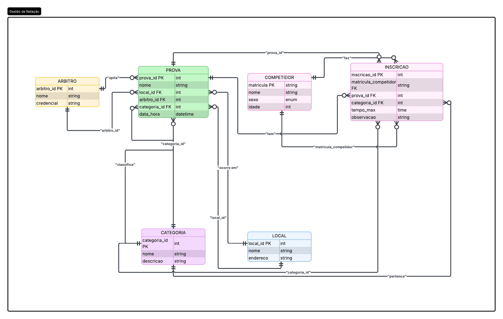

# Gestão de Campeonatos de Natação

## 📌 Apresentação

Este projeto tem como tema a **gestão de campeonatos de natação**, com foco na modelagem e implementação de uma base de dados capaz de organizar e armazenar informações relacionadas a competidores, categorias, provas, árbitros, locais e inscrições.

O sistema foi desenvolvido com o objetivo geral de construir uma **base de dados fundamentada no modelo Entidade-Relacionamento**, capaz de representar de forma estruturada as informações de uma competição de natação e os relacionamentos existentes entre seus diferentes elementos.

A proposta busca garantir a **integridade, consistência e confiabilidade dos dados armazenados**, reduzindo a possibilidade de informações conflitantes ou incorretas e permitindo que os dados das competições sejam consultados de maneira organizada e segura. Dessa forma, informações como participantes, provas, categorias, locais e tempos obtidos podem ser relacionadas de forma coerente dentro da estrutura do banco de dados.

O projeto é direcionado principalmente a **organizações esportivas, clubes de natação, equipes, responsáveis pela organização de competições e profissionais envolvidos no gerenciamento de eventos esportivos**. No contexto acadêmico, também serve como aplicação prática dos conceitos de modelagem de dados, relacionamentos entre entidades, restrições de integridade e organização de informações em bancos de dados relacionais.

## 🎯 Objetivo Geral

Desenvolver uma base de dados para o gerenciamento de campeonatos de natação, utilizando o modelo Entidade-Relacionamento para estruturar e relacionar as informações da competição, buscando manter a **integridade, consistência e confiabilidade dos dados**, de modo que as informações armazenadas possam ser acessadas de forma organizada e não sejam alteradas ou manipuladas de maneira indevida.

## 👥 Público-Alvo

O projeto é destinado a:

* Clubes e equipes de natação;
* Organizadores de campeonatos;
* Federações e entidades esportivas;
* Árbitros e responsáveis pela realização das provas;
* Profissionais responsáveis pelo gerenciamento das competições;
* Estudantes e desenvolvedores interessados em modelagem e implementação de bancos de dados.

## 🏊 Funcionalidades Previstas

O banco de dados deverá permitir o gerenciamento das principais informações de um campeonato de natação, incluindo:

* Cadastro de competidores, contendo matrícula, nome, sexo e idade;
* Cadastro dos locais onde as provas são realizadas;
* Cadastro de categorias, como **Máster** e **Principiante**;
* Cadastro de provas, como **100 metros livre**;
* Associação de cada prova a um árbitro responsável;
* Associação de cada prova a um local específico;
* Registro das inscrições dos competidores nas provas;
* Associação do competidor a uma categoria durante sua inscrição;
* Registro do tempo obtido pelo competidor em cada prova;
* Controle para que o tempo registrado em uma prova não ultrapasse **1 hora**.

## 🗃️ Principais Entidades

A estrutura do banco de dados será composta pelas principais entidades relacionadas à realização de um campeonato:

| Entidade       | Descrição                                                                                                  |
| -------------- | ---------------------------------------------------------------------------------------------------------- |
| **Competidor** | Armazena os dados dos atletas participantes da competição.                                                 |
| **Local**      | Representa os locais onde as provas são realizadas.                                                        |
| **Categoria**  | Define a categoria na qual o competidor participa, como Máster ou Principiante.                            |
| **Prova**      | Representa as modalidades ou distâncias disputadas, como 100m livre.                                       |
| **Árbitro**    | Responsável pela arbitragem das provas.                                                                    |
| **Inscrição**  | Representa a participação de um competidor em determinada prova e categoria, armazenando também seu tempo. |

## 🔗 Relacionamentos

O modelo deverá representar os relacionamentos entre as entidades, permitindo, por exemplo:

* Um **competidor** pode realizar várias inscrições;
* Uma **prova** pode possuir vários competidores inscritos;
* Cada **inscrição** relaciona um competidor a uma prova e a uma categoria;
* Cada **prova** possui um árbitro responsável;
* Cada **prova** ocorre em um local específico;
* O tempo obtido pelo competidor é registrado individualmente em sua inscrição.
## 📊 Diagrama do modelo de entidade relacionamento

## 📚 Contexto Acadêmico

O projeto tem caráter acadêmico e busca aplicar, em um cenário prático, conceitos relacionados à **modelagem de bancos de dados relacionais**, especialmente a identificação de entidades, atributos, relacionamentos, cardinalidades e regras de integridade.

A modelagem pretende representar as regras do domínio da natação diretamente na estrutura do banco de dados, evitando redundâncias desnecessárias e estabelecendo relações que mantenham os dados coerentes durante sua utilização.

---

**Projeto acadêmico — Gestão de Campeonatos de Natação**
